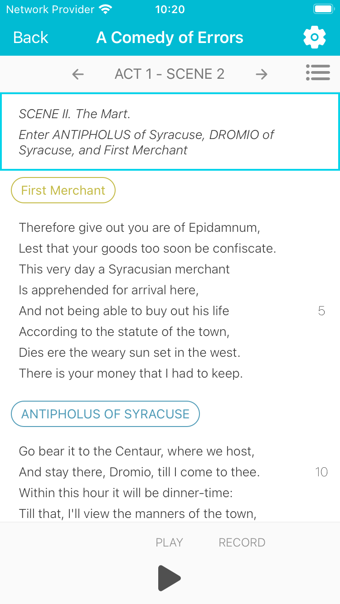

# ActOne

ActOne is a line-learning and rehearsal app for actors. It is designed to help
actors learn their lines and rehearse their parts in a play. The app is
built in React Native using Expo and is based on the original ActOne app built
in Switch for iOS.

This project is a work in progress and is not close to the feature-set of
the original ActOne app. The goal is to have a working prototype that can be
used to learn about React Native as much as it is to build a useful app.

## Preview

<!-- use width attribute as GitHub sanitisation removes style attributes -->

## Usage

### Scripts

install dependencies: `yarn`

start dev server: `yarn dev`

run tests: `yarn test`

check types: `yarn check-types`

### Logging into the app using a local backend

Once the app is running you can sign up or log in using email and password.
This is the recommended way to authenticate within the app.

## Committing

There are a number of pre-commit hooks installed with the repo. The goal of the
hooks are to ensure each commit:

- has consistent style
- does not have build errors
- does not have type errors
- passes the tests

### Good to know

The `yarn check-types` script that is used in the pre-commit hook always checks
the entire project. The reason is because it does a compilation dry-run. This
means you may need to add what you want to staging and then
`git stash save --keep-index` to prevent the script from checking work that is
in progress.

## Style

The project uses styled-components. If there are styles that should be shared
between components these should live in the `src/styles` directory e.g.
`typography.ts`

## Types

Types should be co-located where possible, but for global types rather than
using the `declare` keyword we should add them to the `src/types` folder.
Then they can be imported like any other module. see `src/types/play-types.d.ts`

## Tests

Tests should be co-located with the file they are testing.
Tests use `react-native-testing-library` for rendering and querying.
Navigation is tested in App.tsx tests.

## Plays

Plays are stored in JSON format and are found in the `src/data/plays` directory.
There are a number of unformatted plays found under `src/data/plays/unformatted`.
These plays can be converted into the correct format using
`scripts/format-script.js`. The plays have been auto-generated by someone else
so there is no guarantee the script is good after putting it through the format
script, each will need proof reading.
